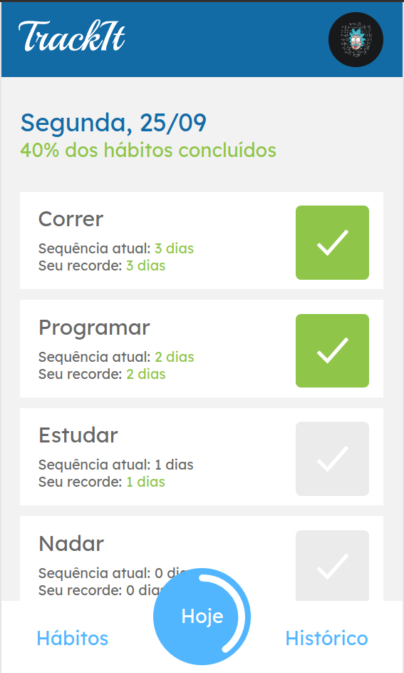
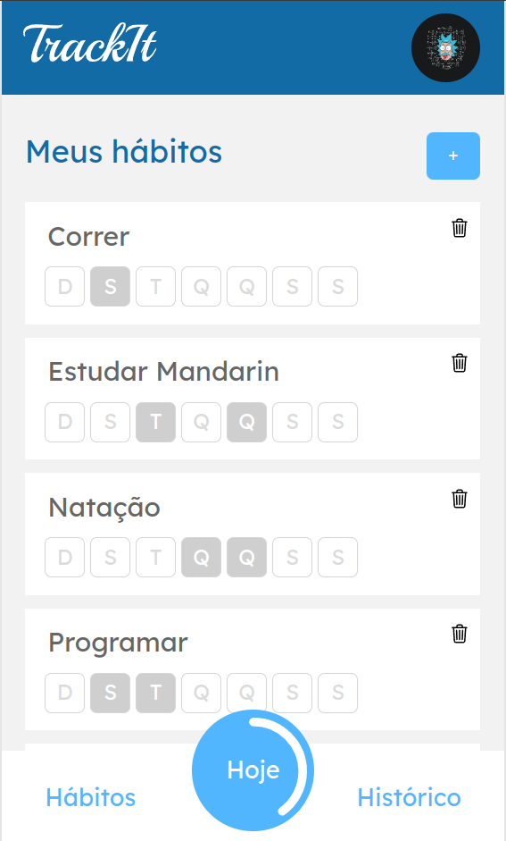

## Description
TrackIt is a mobile sized comprehensive habit tracking application, where the user can add and monitor their habits. The user can add as many habits as they want, selecting the days of the week on which they should perform them. TrackIt can also be used as an automatic to-do list.
<p>


</p>

## Technologies Used
<p>


</p>

## Web Acess
You can access and use the app without installation from the link below.

```
https://track-it-eduardo-jp-ferreira.vercel.app/
```

## Instalation
Clone the Repository: Clone this repository to your local machine.

```
git clone https://github.com/Eduardo-JP-Ferreira/TrackIt.git
```

Install Dependencies: Navigate to the project directory and install the required dependencies.

```
cd Track-It
npm install
```

Run the Application: Start the development server to run the React application.

```
npm start
```


